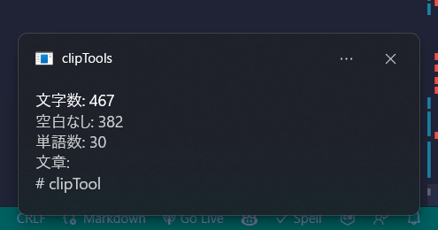

# clipTool

windowsのクリップボードツールです。

## 使い方

```sh
clip-tools
Usage: clip-tools [-v | --version] [-h | --help] <command>
Commands:
    counter
    saveImage [DIR]
    saveText [DIR]
```

### counter

クリップボードの文字数をカウントしてトースト通知します。


### saveImage

クリップボードの画像を保存します。
png形式で保存します。
デフォルトの保存先は、マイ ピクチャ(`System.Environment.SpecialFolder.MyPictures`)です。

### saveText

クリップボードのテキストを保存します。
デフォルトの保存先は、マイ ドキュメント(`System.Environment.SpecialFolder.MyDocuments`)です。
